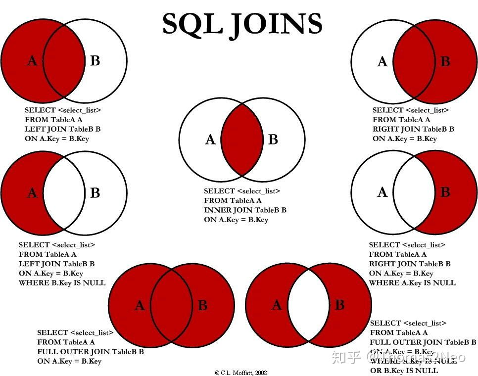

# SQL技巧以及难题整理

**从leetcode上刷了一些数据库的题目，题目的方法和技巧总结如下：**

1.涉及排名多少的问题

举个例子，对于给一个单表（工资表）去挑选前三高工资的员工，核心的做法是，从该表中选出一条数据之后，将该数据在另外一个表中去比较有几条数据比该数据大，从而推断出该数据的排名，可以将这个字段作为排名进行保存（rank）[参考题目：部门工资前三高的所有员工](题目/部门工资前三高的所有员工.md)

2.涉及Join的一些技巧

默认的join为inner join，还有left，right，outer等，对于这些方法，可以看下面的这个图，一目了然，根据实际需求，如果需要对其中一个表中的缺失的数据补充null时，需要参考这个，将表中为null的数据也显示出来。[参考题目：每月交易II](题目/每月交易II.md)

3.员工薪水中位数

这个题目就比较难了，由于中位数涉及到选择的时候需要有奇偶数的情况分别讨论，大概的做法是，先通过每个公司的人数统计，找出这几个中位数，再把这几个中位数对应的到薪水排名的表上，即用到排名的一般方法，就是两个表进行join，有些复杂，是数据库题目中出现的我做过的最难的一个。[参考题目：员工薪水中位数](题目/员工薪水中位数.md)

4.查询第几高的数据（第几高的薪水、价格等）

这种题目使用 LIMIT 输出个数 OFFSET 偏移个数 的方法去做就好，速度很快。当然比如第一名就直接LIMIT1即可。[参考题目：第二高的薪水](题目/第二高的薪水.md)

5.IF函数的使用

涉及到IF函数的使用，经常会搭配一些聚合函数，比如count、sum等，具体用法为IF(condition, exp1, exp2)，如果满足condition则输出为exp1，否则为exp2。注意count中不会计算null，然后sum不会计算0。

6.表join的小技巧

如果需要计算一个表中的聚合指标，去和另外一个表中的对比，可以选择将查询后的聚合指标作为一个表与另外一个表进行join，这样可以在查询过程中，调用另外一个表。

7.连续出现的数字、连续出现的座位等

出现这种考察连续出现的题目，一般情况下的解决方案是通过多个表进行join来完成，比如题目考察连续3次出现，那么你至少就要join3个表。[参考题目：连续出现的数字](题目/连续出现的数字.md)

还有这个考察连续3天人流量的问题。由于需要输出是哪几天，所以还需要考虑去重以及情况考虑全面。[参考题目：体育馆的人流量](题目/体育馆的人流量.md)

还要注意的是日期的连续，可以用DATEDIFF(a.RecordDate, b.RecordDate) = 1来表示。

三天的麻烦一些，但是两天的比较简单，也展示一下。[参考题目：连续空余座位](题目/连续空余座位.md)

8.如果涉及到删除，可以先select需要删除的内容，再将select变为select即可。

9.涉及到序号变换的问题的题目

涉及到序号变换的问题的题目，比如交换位置等，可以直接在select的时候，对序号的内容做条件判断并进行变换。[参考题目：换座位](题目/换座位.md)

10.如果补充不在范围内的数据

可以考虑用union进行数据的补充，然后select后面可以直接补充相关需要填补的内容，null或者其他数字。[参考题目：指定日期的产品价格](题目/指定日期的产品价格.md)

11.子查询相关方法

子查询可以用在很多地方，子查询的结果是一个数据表，可以用在in后面，也可以作为一个表进行join。[参考题目：2016年的投资](题目/2016年的投资.md)

同时，子查询的结果如果是一个数的话，也可以直接用于基本运算，这样会写的很长。[参考题目：好友申请I：总体通过率](题目/好友申请I：总体通过率.md)
